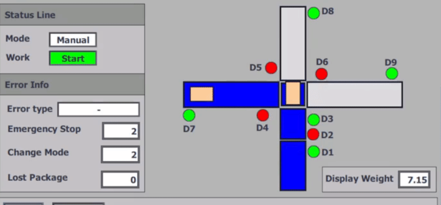
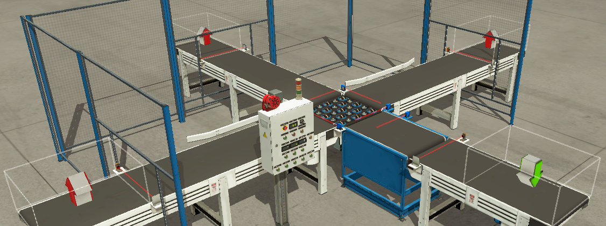

<!-- README.md generated by ChatGPT 🤖 -->

[](https://github.com/Badredenyx/PLC_TIAPortal_Sorting-Project/actions)
[](LICENSE)

# 📦 Ligne de Tri Automatisée par Poids

Bienvenue sur le projet **PLC_TIAPortal_Sorting-Project**, une solution complète de tri automatisé par poids développée sous **TIA Portal V17**, **WinCC**, **Factory I/O** et **PLCSIM Advanced**, déployée sur trois machines virtuelles VMware interconnectées. 🚀

## 📝 Contexte & Motivation

Ce projet a pour objectif de simuler et valider une ligne de tri d’objets par poids sans matériel réel, en offrant :

- 💡 **Programmation PLC (LAD)** sous TIA Portal V17 avec logique de tri fiable. ([github.com](https://github.com/Badredenyx/PLC_TIAPortal_Sorting-Project))
- 🎨 **Interface HMI** intuitive sous WinCC pour une supervision ergonomique. ([github.com](https://github.com/Badredenyx/PLC_TIAPortal_Sorting-Project))
- 🕶️ **Simulation 3D** avec Factory I/O pour reproduire fidèlement le comportement d’une ligne industrielle. ([factoryio.com](https://factoryio.com/?utm_source=chatgpt.com))
- 🌐 **Environnement distribué** : trois VMs (TIA Portal, PLCSIM Advanced, Factory I/O) interconnectées en mode bridge. ([github.com](https://github.com/Badredenyx/PLC_TIAPortal_Sorting-Project))

## 🚀 Fonctionnalités Clés

1. **Tri par catégories de poids** : classification en plusieurs classes (léger, moyen, lourd).
2. **Automate virtuel** : test de la logique PLC via S7-PLCSIM Advanced. ([support.industry.siemens.com](https://support.industry.siemens.com/cs/document/109784440/simatic-step-7-incl.-safety-s7-plcsim-and-wincc-v17-trial-download?dti=0&lc=en-ww&utm_source=chatgpt.com))
3. **HMI WinCC** : visualisation temps réel et contrôle manuel des convoyeurs. ([siemens.com](https://www.siemens.com/us/en/products/automation/industry-software/automation-software/tia-portal.html?utm_source=chatgpt.com))
4. **Factory I/O** : scénarios d’entrée/sortie configurables, capteurs virtuels et actionneurs. ([factoryio.com](https://factoryio.com/?utm_source=chatgpt.com))
5. **Réseau simulé** : configuration ProfiNet/Ethernet dans VMware. ([festo.com](https://www.festo.com/us/en/e/iot-technologies-id_14811/?utm_source=chatgpt.com))

## 📐 Architecture

Plongeons dans l’architecture distribuée via un diagramme Mermaid :

```mermaid
flowchart LR
  subgraph VM1[VM1: TIA Portal V17]
    PLC[TIA Portal Project (.zap17)]
  end
  subgraph VM2[VM2: S7-PLCSIM Advanced V17]
    SIM[S7-PLCSIM Simulation]
  end
  subgraph VM3[VM3: Factory I/O]
    FIO[Factory I/O 3D Scene]
  end

  PLC -->|Téléchargement de la configuration| SIM
  SIM -->|Signaux virtuels| FIO
  FIO -->|Feedback I/O| PLC
```

**Composants détaillés** :
- **VM1** : TIA Portal V17 — éditer et compiler la logique PLC (`.zap17`).
- **VM2** : S7-PLCSIM Advanced V17 — simuler l’automate virtuel.
- **VM3** : Factory I/O — visualiser et interagir avec la scène 3D de tri.

## ⚙️ Installation

1. **Cloner le dépôt** :
   ```bash
   git clone https://github.com/Badredenyx/PLC_TIAPortal_Sorting-Project.git
   ```
2. **Préparer les machines virtuelles** :
   - Installer **VMware Workstation** ou **Player**.
   - Créer 3 VMs Windows 10.
   - Configurer le réseau en **bridge mode**.
3. **Installer les logiciels** :
   - **TIA Portal V17**
   - **SIMATIC S7-PLCSIM Advanced V17**
   - **Factory I/O**
   - **WinCC Runtime Advanced V17**

## ▶️ Usage

1. Démarrer les 3 VMs et vérifier la connectivité réseau.
2. Ouvrir le projet PLC (`.zap17`) dans TIA Portal.
3. Charger la simulation S7-PLCSIM Advanced.
4. Lancer Factory I/O et charger le fichier `Weight Classifying automated Line.factoryio`.
5. Contrôler la ligne via l’HMI WinCC ou déclencher la logique automatique.

## ⚙️ Configuration

- **Adresses IP** :
  - VM1 (PLC) : `192.168.1.10`
  - VM2 (SIM) : `192.168.1.11`
  - VM3 (Factory I/O) : `192.168.1.12`
- **Profinet** : Auto-discovery activé.
- **Paramètres Factory I/O** : Fichier de scène 3D inclus dans `/FactoryIO/`.

## 🤝 Contribuer

Les contributions sont les bienvenues ! 🛠️

1. Forkez le projet.
2. Créez une branche : `git checkout -b feature/ma-fonctionnalite`.
3. Commitez vos modifications : `git commit -m "Added new feature"`.
4. Poussez : `git push origin feature/ma-fonctionnalite`.
5. Ouvrez une Pull Request.

## 📄 Licence

Ce projet est sous licence **MIT**. Consultez le fichier [LICENSE](./LICENSE) pour plus de détails.

## 📸 Captures d’écran & Démo





---
*Fait avec ❤️ par Badredenyx*
